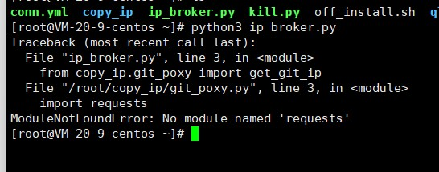

# 此文档仅仅用于学术交流，请勿用于商业用途
# 青龙使用代理池来避免黑IP问题
## TG群 https://t.me/intiidea 
## 此文档默认为最新文档，同步脚本更新此文档
#### 本脚本可能有一些其他问题存在，出现问题请反馈，容器版本会尽快发布
## 运行脚本
安装所需库
```pip3
pip3 install -r requirements.txt
```
测试脚本是否正常
```shell
python3 ip.py
```
先运行上面命令查看脚本是否有问题，没有问题运行下面命令进行，ip_broker.py只是检测脚本是否设置正确
运行脚本并添加守护进程

没有nodejs的使用这个
```shell
python3 kill.py # 开启守护进程
ps -ef|grep ip.py |grep -v grep|awk '{print $2}'|xargs kill -9 # 杀死守护进程
```
有nodejs的使用这个
```shell
pm2 start ip.yml --env productionpid # 开启守护进程
pm2 list # 查看脚本ID HTTPProxy就是
pm2 delete ID # 杀死守护进程
pm2 restart ID # 重启获取输入的ID pm2 restart 3
```

脚本自动添加守护进程，只需python3 kill.py即可，请勿再添加守护进程，使用python3 kill.py可以杀死原来全部ip_broker.py的所有守护进程，而后创建新的
运行后请查看ql.log日志是否有异常信息

## [青龙代理视频演示和使用教程](https://www.youtube.com/playlist?list=PLH5cFwS6-yF-yDy-eGA3nVVa-2Nl43ZKk)

## 文件配置conn.yml

```text
第2行占用端口号
第4行日志文件路径
第6行数据库位置
```
**如果使用nodejs的pm2执行将ip.yml 并且修改PORT和conn.yml第二行端口一致**


## 青龙面板添加依赖

依赖管理-->nodejs-->新建依赖
```text
global-agent
```
依赖管理-->python-->新建依赖
```text
requests
pysocks
```

### 使用报错

如果运行提示图片 import ****** 报错 请安装 pip install ******，或者百度搜索 import ******,
根据需代码提示缺少依赖添加



### 查看是否添加成功
#### python3 检测代理是否添加成功
在青龙脚本管理-->新建脚本-->ip.py
把下内容进去，然后调试，脚本选择python,然后运行，如果显示代理IP表示添加成功

```python3
import requests
aas = requests.get("https://ip.tool.lu/")
print("检测到的IP", aas.text)
```

#### nodejs 检测代理是否添加成功
在青龙脚本管理-->新建脚本-->ip.js
```javascript
const {bootstrap, globalTunnel} = require("global-agent");
bootstrap();
const https = require("https");
https.get('https://ip.tool.lu/' , function (res) {
    console.log('statusCode:', res.statusCode);
    console.log('headers:', res.headers);
    res.on('data', function (d) {
        process.stdout.write(d);
    });
})
```
###  让接口对接青龙教程

配置文件中添加的
```shell
urls="http://IP:端口/js" # 默认5001
url=$(curl $urls)
export GLOBAL_AGENT_HTTP_PROXY=$url
export ALL_PROXY=$url
echo "当前js代理" $url
```

js里面添加的内容
```javascript
const {bootstrap, globalTunnel} = require("global-agent");
bootstrap();
```
```text
所有js脚本都会调用jdCookie.js的内容获取青龙的CK
所以修改jdCookie.js的内容,这样就不用把所有的脚本都改了
既然修改这个脚本就不能把这个脚本拉下来
把jdCookie.js加入到黑名单中，拉取脚本确认jdCookie.js没有被拉下来，如果拉下来修改后也会被覆盖，因为这个问题头疼了一天
这里以脚本为例，重点观察^jd[^_] jdCookie
原本脚本 ql repo 库地址 "jd_|jx_|jdCookie" "activity|backUp" "^jd[^_]|USER|utils|function|sign|sendNotify|ql|JDJR"
修改后的 ql repo 库地址 "jd_|jx_" "jdCookie.js|activity|backUp" "USER|utils|function|sign|sendNotify|ql|JDJR"
在库那新建一个jdCookie.js去仓库把脚本内容并且把 **js里面添加的内容** 添加任意位置
每拉取一个库就修改一个使用代理的情况下，不修改会不走代理
然后就成了
```
## 有想捐赠的可以捐赠下


<details>
  <summary>不可用的代理池</summary>
  <pre><code> 
http://ip.yqie.com/ipproxy.htm 确认不可用
http://www.xsdaili.cn/ 没看到更新，放弃
http://www.taiyanghttp.com/free 放弃没有可用的
https://www.toolbaba.cn/ip 不可用
https://www.atomintersoft.com/high_anonymity_elite_proxy_list 不可用
https://ab57.ru/downloads/proxyold.txt 不可用
http://www.proxylists.net/http_highanon.txt 不可用
https://www.my-proxy.com/free-proxy-list-2.html 不可用
https://www.cnproxy.com/proxy1.html 不可用
https://www.89ip.cn/ 不可用
http://emailtry.com/index/1 不可用
https://pzzqz.com/ 不可用
http://nntime.com/ 不可用
https://list.proxylistplus.com/Fresh-HTTP-Proxy-List-1 不可用
https://openproxy.space/ 不可用
https://www.tyhttp.com/free/ 不可用
https://proxy11.com/ 不可用
http://www.nimadaili.com/ 服务器垃圾
http://www.ip3366.net/
  </code></pre>
</details>

<details>
  <summary>检测可用代理池</summary>
  <pre><code> 
https://premproxy.com/socks-list/
https://api.proxyscrape.com/?request=displayproxies&proxytype=all
https://www.proxyscan.io/
https://pzzqz.com/
http://proxylist.fatezero.org/  可用率高
https://proxy.mimvp.com/freesecret 抓起来麻烦，端口是图片
https://freeproxylists.net/zh/ 1/10
http://www.kxdaili.com/dailiip.html 1/5
http://pubproxy.com/api/proxy 不可用，偶尔可用
https://www.cool-proxy.net/ 九个出一个
https://proxy-list.org/english/index.php bs4加密，可能有反爬，国内不能直接访问，待测试可用时长
https://regex101.com/
https://ip.jiangxianli.com/ 13个出两个
https://www.freeproxylists.net/zh/ 1/20
https://www.proxy-list.download/HTTP 26出一个
http://www.cybersyndrome.net/pla6.html 1/20可用
https://spys.one/en/ 两个
https://raw.githubusercontent.com/TheSpeedX/SOCKS-List/master/http.txt 1/1000
https://raw.githubusercontent.com/mertguvencli/http-proxy-list/main/proxy-list/data.txt 可用率高
https://github.com/mertguvencli/http-proxy-list
https://github.com/monosans/proxy-scraper-checker
https://ip.ihuan.me/ 一个可用
https://hidemy.name/en/proxy-list/ 一个可用
https://www.us-proxy.org/ 5个
https://proxy.seofangfa.com/ 可以使用就一个检测成功的
https://proxy.ip3366.net/
https://www.proxy-list.download/api/v1
https://www.juliangip.com/api?ref=proxy_pool
http://httpbin.org/ip 显示IP的
  </code></pre>
</details>

<details>
  <summary>版本更新</summary>
  <pre><code> 
1.0版本
    > 修复运行多个线程守护而对配置文件照成合并乱码删除的BUG
1.1版本
    > 添加日志输出，输出位置为当前目录下的ql_acting.log
    > ql_acting.log > 10M 会清空日志
1.2版本
    > 换肉不换皮，基本能封闭的都分离的
    > 添加了sqlite3数据库，支持节点筛选
    > 添加国外代理
    > 优化代理检测速度，由原来单线程变成同时检测多个代理，极大减少了未来多节点的检测时间
    > 第一次运行会提示异常，第二次就没有问题了
1.2.1版本
    > 修复了sqlite3数据库获取上次数据问题，无法获取本次代理问题
    > 增加了代理检测，在添加到配置文件的时候又进行了一次检测，但是会导致脚本运行时间延长
1.2.2版本
    > 添加定时任务取消代理
1.2.3版本
    > 添加支持多个容器代理
2.0版本
    > 修复了不能Js不走代理的问题
    > 耗费资源问题，由原来每次都爬取变成少于6次再爬取
    > 为了防止一些代理存活时间过长，四个小时后自动强制爬取一次
    > 添加了接口，由脚本执行调用一次切换一次代理
2.0.1版本
    > 使用了两个表，一个存储代理，一个存储检测结果
2.0.2版本
    > 增加了一些代理池
2.1.0版本
    > 增加了一些代理池
    > 检测服务器位置，根据位置决定是否执行部分代理爬取
    > 第一次会优先出随机国内代理，第二次按照代理池顺序出代理
  </code></pre>
</details>

<details>
  <summary>问题</summary>
  <pre><code> 
代理添加上不能用
    > 青龙2.10版本支持代理版本未知，2.11支持，2.12支持
    > 代理池里IP只能保证添加的时候是可用的，但是添加后能用多久就不知道了，一般2-3分钟
代理池问题
    > 不确定抓取代理池多了是否会被封IP
    > 代理池抓取的IP安全性方面无法保证，请自行选择是否使用
    > 如果因为抓取过多，而被网址封IP，可反馈，有解决方案，但是怕被某些人攻击服务器，只能当备用方案
其他问题
    > 所有反馈都会尽量解决，但是因个人技术问题，不能保证解决所有问题
    > 以后反馈问题会在晚上十点左右回复，白天有时回复，但是不保证
    > 此脚本可能存在其他问题，请自行测试，并且反馈问题
    > 本人只能保证本人仓库的代码的没有任何偷取信息行为，如果有信息泄露，一切与本人无关
    > 此脚本仅限用于学习交流，代码在使用过程中，出现任何不法行为，本人将不承担任何责任
  </code></pre>
</details>
